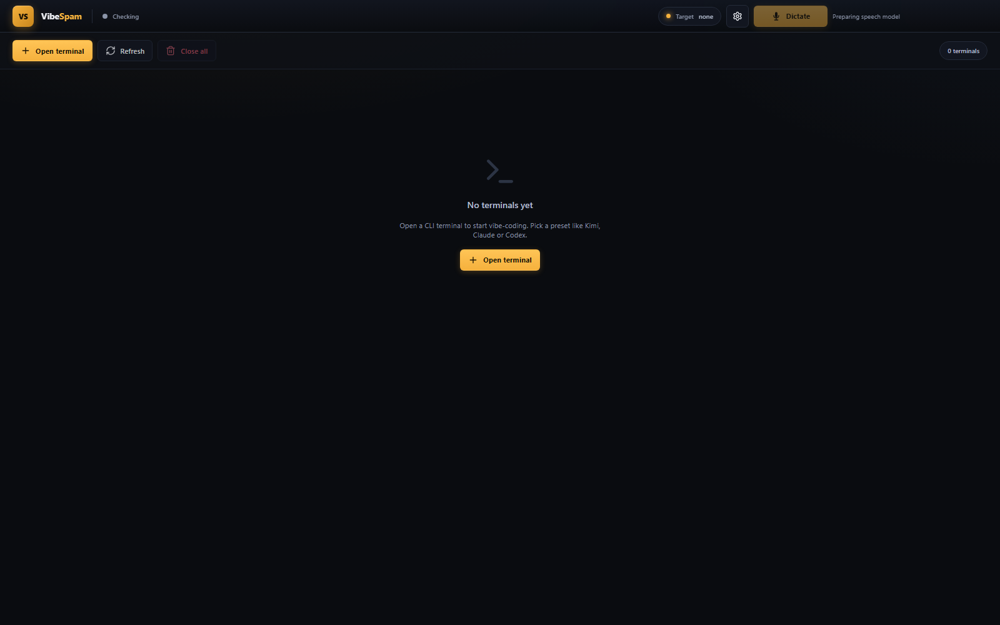

# Vibe Spam

Orquestador de agentes CLI con entrada por voz. Abre tantas terminales como quieras, elige qué CLI usar (Claude, Codex, Kimi, OpenCode, Aider…) y envía comandos hablando en lugar de teclear.



> **Windows es la plataforma principal.** macOS ya funciona con build `.dmg`,
> captura de micrófono y dictado global mediante portapapeles; sigue en beta
> mientras no haya firma Developer ID y notarización. Linux continúa
> experimental.

## Características

- **Terminales bajo demanda**: abre 1, 2, 4 o las que necesites, seleccionando el CLI por terminal.
- **Dictado global**: pulsa `Ctrl + Shift + D` en Windows/Linux o `⌘ + Shift + D` en macOS con el cursor en cualquier caja de texto (Chrome, VS Code, Codex, ChatGPT, lo que sea), habla, y la transcripción se inserta **automáticamente** en esa caja. Véase [Dictado global](#dictado-global).
- **STT intercambiable**: `faster-whisper` (offline) o `OpenWhispr` vía HTTP.
- **Limpieza inteligente**: un LLM local (Ollama) o cheap (Groq) corrige puntuación y formato antes de enviar al CLI.
- **Aplicación de escritorio**: empaquetable con Electron para Windows/Mac/Linux.
- **Comparación A/B**: cambia de modelo STT o cleaner en caliente.

## Estructura

```
vibe-spam/
├── backend/          # FastAPI + PTY + STT + cleaner
├── frontend/         # React + Vite + Electron shell
├── scripts/          # setup, build-backend-exe, build-electron
├── docs/             # arquitectura y decisiones
└── README.md
```

## Requisitos

Para usar una release ya empaquetada en Windows:

- Windows 10/11.
- Un CLI compatible instalado en PATH si quieres abrirlo desde Vibe Spam:
  `claude`, `codex`, `kimi`, `opencode`, `aider`, etc.
- Internet en el primer arranque si usas `faster-whisper`, porque el modelo
  `large-v3-turbo` se descarga en la caché local del usuario. Después queda
  disponible offline.

### Soporte por plataforma

| Plataforma | Estado | Notas |
|---|---|---|
| Windows | Principal | Portable e instalador NSIS. Terminales PTY con WinPTY y dictado global con `inserter.exe`. |
| macOS | Beta | `.dmg`, PTY con `pexpect`, micrófono y dictado global por portapapeles + `⌘V`. Requiere permisos de Micrófono y Accesibilidad; falta firma Developer ID y notarización. |
| Linux | Experimental | Electron puede generar AppImage y el backend usa `pexpect`, pero el dictado global externo necesita un helper específico para X11/Wayland. |

Para desarrollar o compilar desde el código fuente:

- Python 3.11 o 3.12
- Node.js 20.19+ o 22+
- (Opcional) Ollama para el cleaner local
- (Opcional) GPU/CUDA para Whisper más rápido
- (Para empaquetar backend) PyInstaller: `pip install pyinstaller`

## Instalación rápida

### Qué archivo descargar en Windows

Los binarios se publican en [GitHub Releases](https://github.com/amaliogomezlopez/vide-code-spam/releases).
No intercambies los perfiles:

| Descarga | Para quién | Comportamiento |
|---|---|---|
| `Vibe Spam-Setup-*-CPU-x64.exe` | Recomendado para la mayoría | Instalador universal para Windows 10/11. Usa CPU y ocupa mucho menos. |
| `Vibe Spam-Portable-*-CPU-x64.exe` | Quien no quiera instalar | Ejecutable portable universal. Usa CPU. |
| `Vibe Spam-Setup-*-CUDA-x64.exe` | Equipos con GPU NVIDIA compatible | Instalador acelerado con CUDA/float16. Más rápido y aproximadamente 2,55 GiB una vez desplegado. |
| `Vibe Spam-Portable-*-CUDA-x64.exe` | NVIDIA sin instalación | Portable acelerado, con el mismo runtime CUDA incluido. |

**CPU funciona en cualquier equipo compatible y es la descarga segura por
defecto. CUDA solo aporta aceleración en NVIDIA y es mucho más grande.** El
perfil CPU no puede autodetectar CUDA porque deliberadamente no contiene sus
librerías; para usar GPU hay que descargar el artefacto CUDA.

Las primeras releases se publican sin firma Authenticode. Comprueba el SHA-256
publicado y consulta las [limitaciones conocidas](docs/KNOWN_LIMITATIONS.md)
antes de ejecutar el archivo si Windows muestra SmartScreen.

### Instalación desde código fuente

Windows (PowerShell):

```powershell
cd D:\10-VIBE-SPAM
.\scripts\setup.ps1
```

Linux/macOS (bash):

```bash
cd vibe-spam
./scripts/setup.sh
```

En macOS, si el `python3` del sistema es 3.9, instala Python 3.12 o pasa su ruta:

```bash
brew install python@3.12
VIBE_SPAM_PYTHON="$(brew --prefix python@3.12)/bin/python3.12" ./scripts/setup.sh
```

Consulta la [guía de macOS](docs/MACOS.md) para permisos, desarrollo y `.dmg`.

O manualmente:

```bash
cd D:/10-VIBE-SPAM

# Backend
python -m venv backend/.venv
source backend/.venv/bin/activate  # Windows: backend\.venv\Scripts\activate
pip install -r backend/requirements.txt

# Frontend
cd frontend
npm ci
cd ..

# Entorno
cp .env.example .env   # edita .env si quieres
```

Para descargar o recalentar el modelo de voz después:

```powershell
.\scripts\install-models.ps1
```

El mismo modo existe en el backend empaquetado:

```powershell
.\VibeSpam-Portable\resources\backend\vibe-spam-backend.exe --install-models
```

## Uso en desarrollo

```bash
# Terminal 1: backend (desde la raíz del repo)
source backend/.venv/bin/activate
uvicorn backend.app.main:app --reload --host 127.0.0.1 --port 8000

# Terminal 2: frontend
cd frontend
npm run dev
```

Abre la URL que muestre Vite (normalmente http://localhost:5173; si está ocupado usará el 5174 — mira la consola de Vite).

Haz clic en **+ Open terminal**, elige CLI y número de terminales, selecciona una terminal y pulsa **🎤 Push to talk**.

### CLIs y rutas personalizadas

El modal **Open workspace → CLI manager** detecta automáticamente Codex,
Claude Code, Kimi Code, Grok Build, OpenCode, Aider, MiniMax Mini-Agent y MMX.
Busca en `PATH`, ubicaciones de instalación comunes y, en Windows, también en
WSL. Cada resultado muestra ruta, runtime y versión.

Si un CLI no está en esas ubicaciones, usa **Add local executable** para elegir
su `.exe`, `.cmd`, `.bat` o binario. Los perfiles se guardan por usuario en la
carpeta de configuración de Vibe Spam. La app no instala CLIs ni guarda sus API
keys: instala y autentica cada herramienta siguiendo su documentación oficial,
y pulsa **Rescan**.

### Trabajo paralelo y Git worktrees

Para repositorios distintos, abre una terminal por carpeta o usa **Parallel
workspace** y asigna un `cwd` a cada worker. Para varios agentes escritores en
el mismo repositorio, activa **Worktree** en todos salvo el coordinador:

```text
checkout principal   → coordinador / revisión
worktree backend      → rama vibe/backend-...
worktree frontend     → rama vibe/frontend-...
worktree tests        → rama vibe/tests-...
```

La creación es transaccional: si un CLI o PTY falla, se cierran los agentes ya
abiertos y se revierten los worktrees creados. Las tarjetas muestran rama y
estado Git. **Worktree** elimina únicamente un worktree limpio y conserva su
rama; con cambios sin commit, la operación se rechaza para evitar pérdida de
trabajo.

No ejecutes dos agentes escritores sobre el mismo checkout. Integra sus ramas
mediante revisión, pull request, merge o cherry-pick desde el coordinador.

## Empaquetar como aplicación de escritorio

En Windows hay dos formatos recomendados:

- **Portable**: carpeta autocontenida con `Vibe Spam.exe`, ideal para probar o
  copiar a otra máquina.
- **Instalador NSIS**: `.exe` instalable con accesos directos de Escritorio y
  menú Inicio, más cómodo para compartir con usuarios finales.

Los pesos del modelo Whisper no se suben a GitHub ni se meten por defecto en el
instalador: son grandes y pertenecen a la caché local del usuario. La app los
descarga automáticamente al arrancar el backend por primera vez, y también se
pueden preparar con `--install-models`.

### 1. Backend como ejecutable

Windows:

```powershell
.\scripts\build-backend-exe.ps1
```

Linux/macOS:

```bash
./scripts/build-backend-exe.sh
```

Esto genera `frontend/backend-dist/vibe-spam-backend.exe` en Windows o
`frontend/backend-dist/vibe-spam-backend` en macOS/Linux.

El build predeterminado es **CPU** y no incluye las DLLs NVIDIA, lo que reduce
aproximadamente 1,9 GiB del paquete. Para crear deliberadamente un build CUDA en
Windows:

```powershell
.\backend\.venv\Scripts\pip.exe install -r backend\requirements-cuda.txt
.\scripts\build-backend-exe.ps1 -Cuda
```

En Linux usa `VIBE_SPAM_CUDA_BUILD=1 ./scripts/build-backend-exe.sh` después de
instalar las dependencias CUDA apropiadas.

### 2. App Electron

Portable Windows:

```powershell
# CPU universal
.\scripts\build-backend-exe.ps1
.\scripts\build-electron.ps1

# CUDA opcional (NVIDIA, mucho más grande)
.\scripts\build-backend-exe.ps1 -Cuda
.\scripts\build-electron.ps1 -Variant CUDA
```

Linux/macOS:

```bash
./scripts/build-electron.sh
```

En macOS/Linux los artefactos salen en `frontend/release/` según el target de
`electron-builder` (`dmg` en macOS, `AppImage` en Linux). El build macOS incluye
las descripciones de privacidad del micrófono y el pegado global por
portapapeles; aún falta firmarlo y notarizarlo para distribución pública. Linux
todavía necesita una implementación de inserción global para X11/Wayland.

Los ejecutables finales listos para doble clic quedan en:

```
VibeSpam-Portable/Vibe Spam.exe
VibeSpam-Portable-CUDA/Vibe Spam.exe
```

Abre esa carpeta y haz doble clic en `Vibe Spam.exe`. La app arranca con el backend ya corriendo en segundo plano.

Instalador Windows + portable:

```powershell
# CPU
.\scripts\build-windows-installer.ps1

# CUDA
.\scripts\build-windows-installer.ps1 -Cuda
```

Las primeras releases públicas se distribuyen deliberadamente sin firma
Authenticode. Usa `-AllowUnsigned`, publícalo de forma visible en las notas y
acompaña cada archivo con su SHA-256. Si en el futuro se configura
`CSC_LINK`/`CSC_KEY_PASSWORD`, el mismo pipeline validará la firma.

Los artefactos CPU y CUDA salen separados en `frontend/release/CPU/` y
`frontend/release/CUDA/`, con el perfil incluido en el nombre del archivo.
Antes de una release estable completa [`docs/RELEASE_CHECKLIST.md`](docs/RELEASE_CHECKLIST.md).

El botón de dictado permanece desactivado durante el warmup. Cuando está listo
muestra el dispositivo y modelo efectivos (`cpu · large-v3-turbo` o
`cuda · large-v3-turbo`). Esto evita que la primera grabación compita con la
carga del modelo y parezca bloqueada o imprecisa.

### Cómo funciona el modo Electron

- `frontend/electron/main.ts` arranca el backend como proceso hijo.
- En desarrollo carga `http://localhost:5173`.
- En producción carga los archivos estáticos de `frontend/dist` y ejecuta el backend empaquetado desde `resources/backend/`.

### Atajos globales (configurables)

Por defecto:

- `Ctrl/⌘ + Shift + Espacio`: push-to-talk global (inicia/para grabación y envía a la terminal seleccionada).
- `Ctrl/⌘ + Shift + D`: dictado global — inserta la transcripción en la caja de texto enfocada de **cualquier app** (activa la opción *Global dictation* en Settings).
- `Ctrl/⌘ + Shift + V`: muestra/trae la ventana de Vibe Spam al frente.

Puedes cambiarlos desde **Settings → Shortcuts** (sin tocar código) o editando los defaults en `frontend/electron/main.ts`. Usa la sintaxis de aceleradores de Electron.

## Dictado global

El dictado global te permite hablar y que el texto transcrito aparezca en la caja de texto de **cualquier aplicación**, no solo en las terminales de Vibe Spam. Activarlo:

1. **Settings → Shortcuts → Global dictation** (checkbox).
2. Pon el cursor en una caja de texto de la app que quieras (el navegador, VS Code, Codex, ChatGPT…).
3. Pulsa `Ctrl/⌘ + Shift + D`, habla, y espera la parada automática por silencio (o vuelve a pulsar el atajo).
4. La transcripción se inserta en esa caja de texto.

En macOS, concede **Micrófono** la primera vez que grabes y **Accesibilidad** al
activar el dictado global. La app deja la transcripción en el portapapeles y
envía `⌘V` al campo que conserva el foco. El estado de ambos permisos aparece
en **Settings → Shortcuts**. Usa el atajo `⌘⇧D`: en algunas versiones de macOS,
pulsar la burbuja flotante activa Vibe Spam y deja de preservar la aplicación
de destino.

### Cómo funciona la "última milla"

Insertar texto en la caja de texto de otra app es la parte delicada del dictado global. En Windows se hace con un **helper nativo compilado**; en macOS Electron conserva la app enfocada, escribe la transcripción con la API nativa de portapapeles y usa System Events para enviar `⌘V` con permiso de Accesibilidad.

- `frontend/inserter/Inserter.cs` — fuente C# (.NET Framework 4, compilable con `csc.exe` incluido en Windows).
- `scripts/build-electron.ps1` lo compila **antes** de `electron-builder` y se empaqueta en `resources/inserter/inserter.exe`.

El helper expone tres subcomandos:

- `inserter.exe capture` — captura el **control enfocado** vía UIAutomation (con `RuntimeId` estable), no solo la ventana. Lo invoca Electron al pulsar el atajo, antes de grabar.
- `inserter.exe insert --capture <json> --text <path>` — re-localiza ese control exacto, le hace `SetFocus`, y aplica una cadena de inserción verificada: **Ctrl+V** (comprobando que el `Value` creció) → `ValuePattern.SetValue` (solo en campos vacíos) → `SendInput` Unicode → mensaje de error claro si todo falla.
- `inserter.exe selftest` — autodiagnóstico: reporta el `cbSize` de la struct `INPUT` y el valor de retorno de `SendInput` (útil si algo deja de funcionar).

**Lección clave** (por qué antes no pegaba): hay que capturar el **control de texto exacto** (el que tiene el caret) y re-enfocar **ese** control al pegar. Traer la ventana al frente con `SetForegroundWindow` no restaura el foco de teclado dentro del textarea. Detalles técnicos y la historia de los bugs resueltos en `CHANGELOG.md` y `AGENTS.md`.

## Seguridad local

El backend puede lanzar ejecutables, por lo que no debe exponerse directamente
a una red. Los defaults escuchan solo en `127.0.0.1`. Electron genera un token
efímero en cada arranque y lo adjunta a HTTP y WebSocket automáticamente.

Si ejecutas el backend deliberadamente en una interfaz no local, debes definir
`VIBE_SPAM_API_TOKEN`. El backend empaquetado rechazará un bind no-loopback sin
token o sin el modo proxy confiable usado por Docker. Docker Compose publica
solo el frontend y Ollama en `127.0.0.1`; el puerto del backend queda dentro de
la red privada de Compose.

## Configuración

Edita `.env` o las variables de entorno:

| Variable | Descripción |
|----------|-------------|
| `STT_PROVIDER` | `faster-whisper` o `openwhispr` |
| `WHISPER_MODEL_SIZE` | `tiny`, `base`, `small`, `medium`, `large-v3-turbo`… |
| `LLM_CLEANER_PROVIDER` | `ollama`, `groq` o `none` |
| `LLM_CLEANER_MODEL` | modelo para limpiar la transcripción |
| `OLLAMA_BASE_URL` | URL de Ollama |
| `GROQ_API_KEY` | API key de Groq (solo si usas Groq) |
| `VIBE_SPAM_API_TOKEN` | Token requerido para clientes externos a Electron o binds no-loopback |
| `MAX_AUDIO_BYTES` | Límite acumulado por grabación; default 20 MiB |

## Notas importantes

- **Defaults para máxima compatibilidad**:
  - `WHISPER_DEVICE=cpu`
  - `WHISPER_COMPUTE_TYPE=int8`
  - `LLM_CLEANER_PROVIDER=none`
  Esto hace que el STT funcione sin GPU y sin depender de Ollama/Groq. Puedes cambiarlo en `.env`.
- **CUDA en Windows**: el perfil CPU no instala librerías NVIDIA. Para aceleración
  GPU usa `backend/requirements-cuda.txt` y construye con `-Cuda`; el backend
  seguirá funcionando en CPU cuando CUDA no esté disponible. `WHISPER_DEVICE=auto`
  solo selecciona CUDA cuando puede cargar el runtime completo; `cpu` nunca se
  sobreescribe. Si un `.env` antiguo fuerza `cuda` sobre un portable CPU, la app
  registra el diagnóstico y degrada automáticamente a `cpu/int8`.
- **Puerto 5174 en lugar de 5173**: Vite intenta el 5173; si está ocupado usa el siguiente disponible (5174, 5175…). Mira siempre la URL que imprime Vite en consola. Si usas Electron en desarrollo, `electron/main.ts` apunta a `http://localhost:5173`; si Vite usa otro puerto, cambia temporalmente la URL en `frontend/electron/main.ts` o libera el 5173.
- **ffmpeg**: `pydub` lo usa para normalizar audio. En Windows debe estar en el PATH. Si no lo tienes, instálalo con `winget install Gyan.FFmpeg` o añade el binario a este repo.
- **Permisos de micrófono**: el navegador/Electron pedirán permiso la primera vez.
- Consulta la lista completa de [limitaciones conocidas](docs/KNOWN_LIMITATIONS.md),
  incluida la primera descarga del modelo, SmartScreen, permisos y CLIs externas.

## API relevante

Salvo `/api/health`, las rutas requieren el token efímero de Electron cuando
está configurado. En desarrollo sin token solo se aceptan clientes loopback y
orígenes Vite locales.

- `GET /api/agents` — lista agentes
- `POST /api/agents` — crea un agente dinámicamente
- `DELETE /api/agents/{id}` — cierra y borra un agente
- `POST /api/agents/{id}/send` — envía texto limpio al CLI
- `WS /ws/audio` — recibe audio, devuelve transcripción
- `WS /ws/terminal/{id}` — puente PTY con la terminal

## Roadmap

- [x] Crear/borrar terminales dinámicamente.
- [x] Electron + empaquetado de backend.
- [x] Hotkeys globales: push-to-talk (`Ctrl+Shift+Espacio`) y dictado global (`Ctrl+Shift+D`).
- [x] VAD para cortar silencios automáticamente (autostop tras 3 s).
- [x] Dictado global con inserción automática en cualquier app vía helper nativo.
- [ ] Métricas de latencia/WER para comparar STT.
- [ ] Modo comparación 2×2.

## Licencia

[MIT](LICENSE)

## Comunidad y publicación

- [Cómo contribuir](CONTRIBUTING.md)
- [Política de seguridad](SECURITY.md)
- [Código de conducta](CODE_OF_CONDUCT.md)
- [Publicar un snapshot limpio](docs/PUBLISHING.md)
